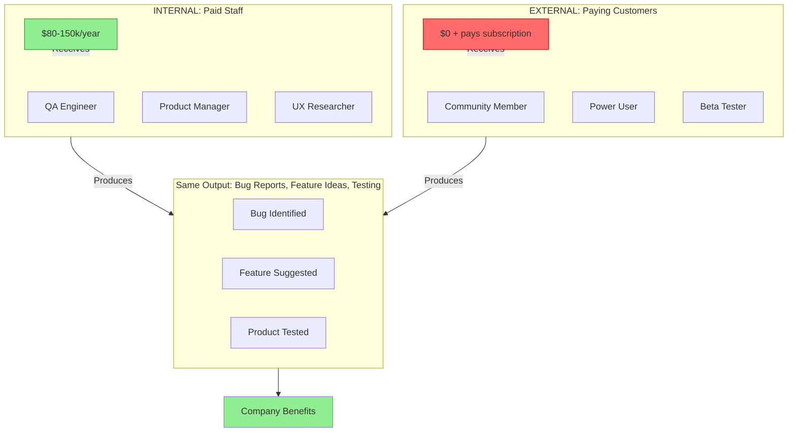
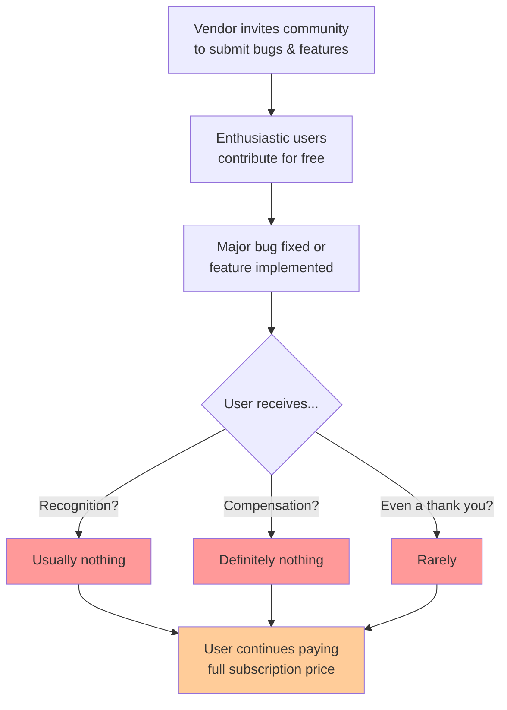
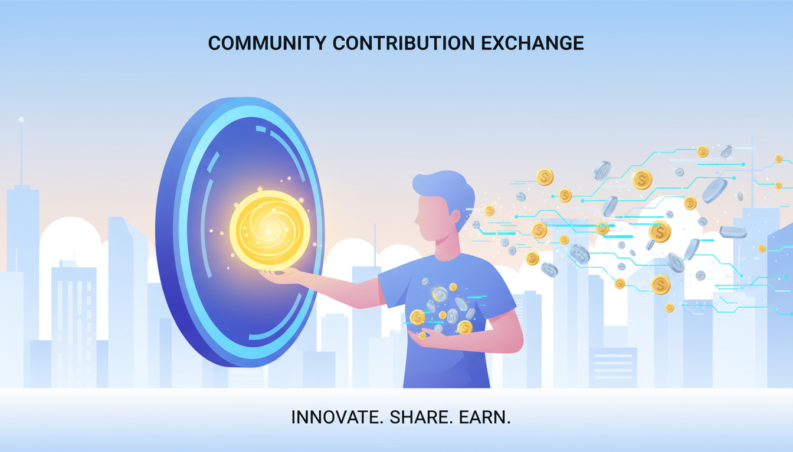
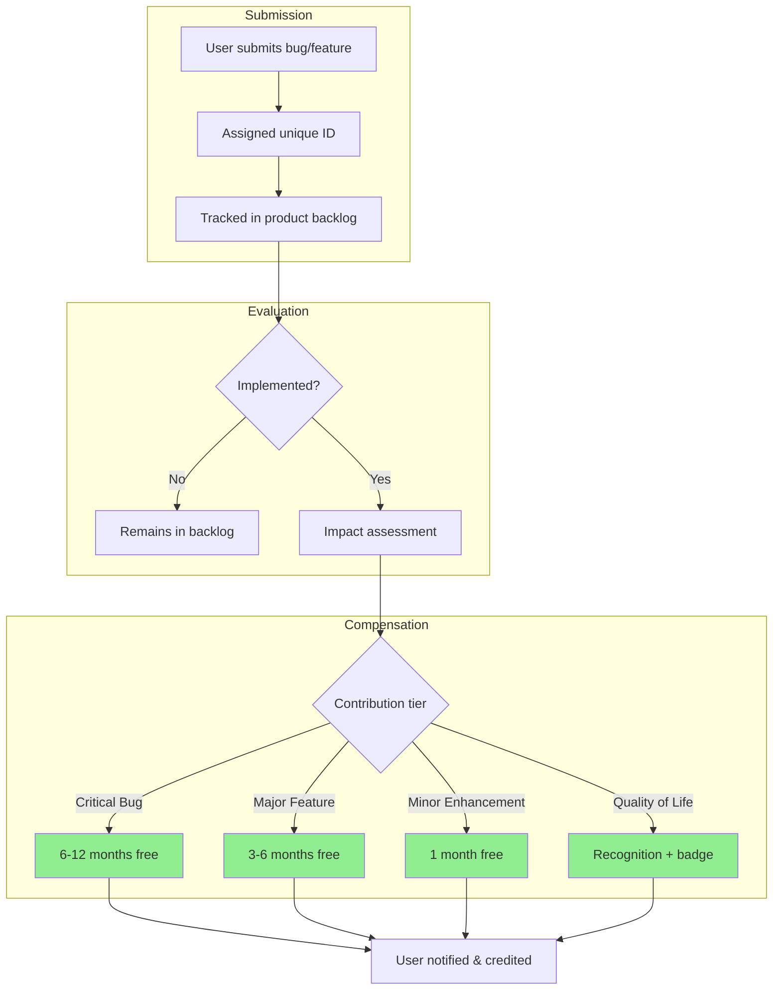
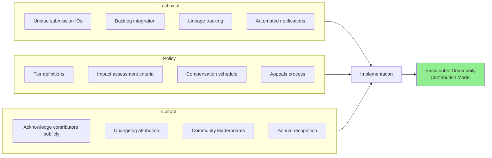

# Pay For Ideas

> **TL;DR**: Paying customers who report bugs and suggest features for commercial software often save companies millions—yet receive nothing in return. This creates an unsustainable asymmetry where vendors treat community engagement as free labor. This note proposes a compensation framework to fix that.

---

## Attribution

**Human contributions:**
- Original concept and idea
- Initial draft and core arguments
- Personal anecdotes and examples

**AI contributions (Claude Code):**
- Light editing and structural improvements
- Subheadings and document organization
- Mermaid diagrams illustrating the concepts
- Generated illustrations using Nano Banana

This document was developed collaboratively. The core thesis and arguments are human-originated; AI assisted with presentation and visualization.

---

I plan to get around to coming up with some kind of a badge system for repositories that I create from time to time to jot down notes or ideas for implementations or projects. I create these as repositories rather than just notes because sometimes they involve prototype scripts and GUIs or CLIs.

With the advent of agentic AI (and particularly the joys of voice typing!) creating these has become a much more fluid and enjoyable and streamlined experience.

---

## The Problem

Every idea begins with identifying either a need or something that feels in some way broken. So let me start by defining that.

I recently identified and documented a bug in a major software platform used by tens of millions of users every day. That bug was subsequently patched and the patch was highlighted in a version release. I do not feel like it would be either tactful or pertinent to name the company and it would not add substantially to this thread. It was also not the first time that I've had this experience.

**The next day I paid my monthly invoice for this platform.**

In other instances, I've seen feature requests implemented and win plaudits from the user community (I have lots of bad ideas but the odd good one).

### The Current Model: A Tale of Two Contributors

**The disparity is stark:** Internal staff and external users often provide *identical* value—bug reports, feature ideas, usability feedback—but compensation flows in opposite directions. One group gets paid handsomely; the other pays for the privilege of contributing.

---

## The Asymmetry: When Open Source Norms Meet Commercial Reality

It would be wrong to say that this leaves a bad taste in my mouth. But correct to say that something about it doesn't feel quite right.

If we can trace this feeling through its stages, it would go something like this:

### The Root Cause

The reason for this disconnect can perhaps be explained in large part by the fact that **open source does not automatically denote "free."**

In the case of open source projects which *are* free, users and developers can more readily feel as if they are equal contributors to a larger project and part of an equitable bargain.

**That equation goes out the window, however, when one of the parties is financially profiting from the software (a tech vendor) and the other is not (a user).**

| Scenario | User Contribution | Vendor Benefit | User Compensation |
|----------|-------------------|----------------|-------------------|
| Open Source (Free) | Bug report | Better software | Better software (mutual) |
| Open Source (Free) | Feature idea | New capability | New capability (mutual) |
| **Commercial SaaS** | Bug report | Reduced churn, avoided losses | **Nothing** |
| **Commercial SaaS** | Feature idea | Competitive advantage, new revenue | **Nothing** |

The asymmetry is stark. In one model, the exchange is equitable. In the other, it's exploitation dressed up as "community engagement."

---

## The Real Cost of "Free" Community Input

Let's be blunt about what's actually happening:

- A user identifies a critical bug that's causing customer churn
- The company fixes it, retaining thousands of customers worth millions in ARR
- The user who saved them that money? Still pays $29/month like everyone else

**This is not community engagement. This is unpaid labor with extra steps.**

Technology vendors pay handsomely for equivalent inputs when they come from employees or contractors:

| Input Source | Compensation |
|--------------|--------------|
| Internal QA Engineer | $80-150k/year salary |
| UX Researcher | $90-140k/year salary |
| Product Consultant | $150-300/hour |
| Security Researcher (via bounty) | $500-$50,000+ per finding |
| **Community Bug Reporter** | **$0** |
| **Community Feature Requester** | **$0** |

The vendors are getting professional-grade input at zero cost, while simultaneously charging those same contributors subscription fees. This asymmetry is not reasonable.

---

## A Fairer System: Compensation to Prevent Community Contribution Churn

A question to think about is: *"well, what would a fairer system be?"*

I suggest that the system by which passionate users are invited to contribute feature requests or report bugs to paid products out of goodwill is an **unsustainable and fundamentally unfair one.**

Users can realize this and decide that on principle they will simply stop reporting bugs or suggesting features. But this deprives the vendor of what may have been an otherwise useful source of input to the product—a classic tragedy of the commons.

### Proposed Model: Pay-on-Adoption

The mechanism I'm proposing would attempt to create a system that works for both parties:

### Feature Requests

Feature requests are always treated as speculative in the first instance.

However, it may in some cases be possible to identify that a specific feature request was implemented in a release. Feature requests should therefore be ID'd and maintained, and that data should be integrated into product development lifecycles.

**If a clear lineage can be established between a feature request and the development of a profitable feature in the application, then the submitting user should be compensated in some format.**

This could be in the form of:
- Free usage for a period (proportional to feature significance)
- Indefinite free access for major feature contributions
- A sliding scale where contributions of different significance are awarded with different rewards

### Bug Reports

Companies do sometimes compensate bug reports, but typically only in limited circumstances—specifically security vulnerabilities documented through externally audited bounty programs.

Often these bounties are well compensated, which creates an **enormous disparity** between:
- The many bugs that get pointed out and resolved outside the security context
- The few that get remediated within it

A UI/UX bug could affect millions of users and cause a company vast financial loss in churn to a competitor. But if it falls outside the scope of a security bounty program, it will be unrewardable.

**Because of this, it is possible—and indeed maybe commonplace—for paying subscribers to save companies huge sums of money, dwarfing their lifetime revenue value, without even receiving a summary thanks in return.**

My proposal: a parallel track to security bug reporting should be rolled out for generalist bug tracking.

### Handling the Gray Area

Sometimes the gap between a feature request and a bug is a nebulous one. What some users may consider a bug—a total impediment to reasonable functionality—may be only a trivial concern to another.

Rather than get bogged down in the semantics of whether any particular suggestion from a community member falls into one category or the other, it may be fairer and easier to create a unified **"pay on adoption"** compensation mechanism that rewards both regardless.

---

## Implementation Considerations

### Minimum Viable Recognition

Even without financial compensation, vendors could immediately implement:

1. **Changelog attribution**: "Fixed [issue] - thanks to @username"
2. **Public acknowledgment**: Monthly/quarterly contributor highlights
3. **Badge systems**: Visible recognition in community profiles
4. **Beta access**: Early access to features for active contributors

These cost nothing and would go a long way toward making contributors feel valued.

---

## Conclusion

The current model treats community engagement as an infinite well of free labor. It isn't. Contributors eventually burn out, become cynical, or simply stop participating when they realize the exchange is fundamentally one-sided.

**A company that genuinely values its community would put its money where its mouth is.**

The vendors who figure this out first will build more loyal communities, receive higher-quality feedback, and differentiate themselves in increasingly competitive markets. Those who don't will eventually find their "community engagement" channels full of tumbleweeds.

---

## Status

This is an early-stage idea. Feedback welcome via issues or discussions.

## Author

Daniel Rosehill
[danielrosehill.com](https://danielrosehill.com)
